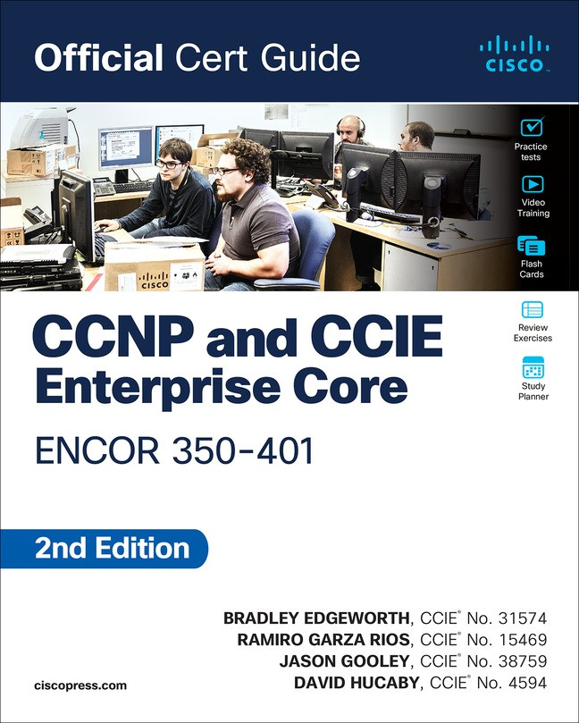

# CCNP-ENCOR-Labs
This repository contains hands-on labs for CCNP ENCOR (350-401), covering core enterprise networking topics such as Layer 2, Layer 3, IP Services, Security, and Automation. Each lab includes configurations, topology diagrams, verification steps, and troubleshooting scenarios to demonstrate practical networking skills.

  

